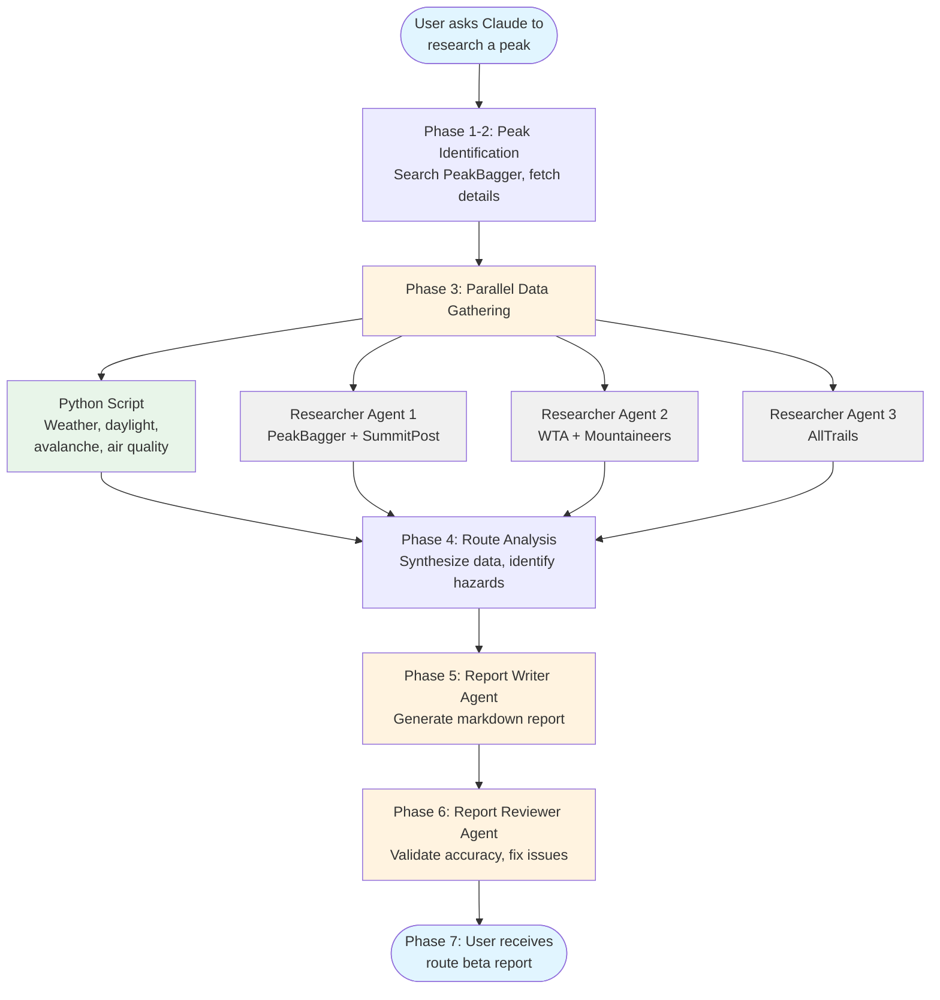

<h1 align="center">Mountaineering Skills for Claude Code</h1>

<p align="center">
  <a href="https://github.com/hesreallyhim/awesome-claude-code">
    
  </a>
  <a href="https://docs.anthropic.com/en/docs/claude-code/overview">
    
  </a>
</p>

<h4 align="center">Automated mountain route research for North American peaks, built for <a href="https://claude.com/claude-code" target="_blank">Claude Code</a>.</h4>

<p align="center">
  <a href="#quick-start">Quick Start</a> •
  <a href="#how-it-works">How It Works</a> •
  <a href="#features">Features</a> •
  <a href="#installation">Installation</a> •
  <a href="#support">Support</a>
</p>

Ask Claude to research any mountain. The route-researcher skill pulls from 10+ mountaineering sources and compiles a detailed Markdown report with current weather, avalanche conditions, daylight windows, trip reports, and route beta. What used to take 3-5 hours of tab-hopping now takes 3-5 minutes.

<p align="center">
  
</p>

**See it in action:**

| Peak | Elevation | What it shows |
|------|-----------|---------------|
| [Mount Si](skills/route-researcher/examples/2025-10-23-mount-si.md) | 4,167 ft | High-traffic trail with abundant trip reports |
| [Mount Adams](skills/route-researcher/examples/2025-11-06-mount-adams.md) | 12,280 ft | Glaciated volcano with weather/avy conditions |
| [Wolf Peak](skills/route-researcher/examples/2025-11-06-wolf-peak.md) | 5,813 ft | Technical scramble with sparse beta |
| [Mount Shuksan](skills/route-researcher/examples/2026-01-29-mount-shuksan.md) | 9,129 ft | Glacier climb requiring crevasse rescue skills |
| [Tinkham Peak](skills/route-researcher/examples/2026-01-29-tinkham-peak.md) | 5,398 ft | Accessible Class 2-3 scramble near Snoqualmie Pass |

---

## Quick Start

```
/plugin marketplace add dreamiurg/claude-mountaineering-skills
/plugin install mountaineering-skills@mountaineering-skills-marketplace
```

Restart Claude Code, then ask:

```
"Research Mount Rainier"
```

That's it. Claude generates a route beta report in your current directory.

---

## How It Works

The skill uses a hybrid architecture: Python scripts for deterministic API calls, LLM agents for tasks requiring judgment.



Three researcher agents gather data in parallel while a Python script fetches conditions. Dedicated agents write and review the final report. If a source fails, the skill documents the gap and continues.

---

## Features

### Data Sources

The skill aggregates from specialized mountaineering sites:

| Category | Sources |
|----------|---------|
| Peak info | [PeakBagger](https://www.peakbagger.com) |
| Routes | [SummitPost](https://www.summitpost.org), [WTA](https://www.wta.org), [AllTrails](https://www.alltrails.com), [The Mountaineers](https://www.mountaineers.org) |
| Weather | [Open-Meteo](https://open-meteo.com), [NOAA/NWS](https://www.weather.gov) |
| Avalanche | [NWAC](https://nwac.us), regional centers |
| Trip reports | [PeakBagger](https://www.peakbagger.com), [WTA](https://www.wta.org), [The Mountaineers](https://www.mountaineers.org) |

**Coverage note:** Report quality depends on how well-documented your peak is across these sources. Works best for popular North American peaks.

### Graceful Degradation

Missing data? The skill notes what's unavailable in an "Information Gaps" section and provides manual lookup links. You always get a report, even if some sources are down.

---

## Installation

**Prerequisites:** [Claude Code](https://docs.anthropic.com/en/docs/claude-code/overview), optionally [uv](https://docs.astral.sh/uv/) for Python tools.

```
/plugin marketplace add dreamiurg/claude-mountaineering-skills
/plugin install mountaineering-skills@mountaineering-skills-marketplace
```

Python dependencies install automatically if `uv` is available.

**Verify it worked:**

```
"What skills are available?"
```

You should see `route-researcher` in the list.

---

## Usage

Just ask naturally:

```
"Research Mt Baker"
"Get route beta for Forbidden Peak"
"I'm planning to climb Sahale Peak, can you research it?"
```

Reports save to your current directory as `YYYY-MM-DD-peak-name.md`.

---

## Dependencies

- [peakbagger-cli](https://github.com/dreamiurg/peakbagger-cli) v1.7.0 - peak data and trip reports
- [Python tools](skills/route-researcher/tools/README.md) - weather, avalanche, and daylight calculations

---

## Updates

```
/plugin list                          # check current version
/plugin update mountaineering-skills  # update to latest
```

---

## Contributing

Pull requests welcome. See [CONTRIBUTING.md](CONTRIBUTING.md).

---

## Support

[Open an issue](https://github.com/dreamiurg/claude-mountaineering-skills/issues) or [start a discussion](https://github.com/dreamiurg/claude-mountaineering-skills/discussions).

---

## Other Mountaineering & Outdoors Tools

I climb, scramble, and hike a lot, and I keep building tools around it. If this one's useful to you, the others might be too:

- **[mountaineers-mcp](https://github.com/dreamiurg/mountaineers-mcp)** -- MCP server that lets AI assistants search and browse mountaineers.org. Activities, courses, trip reports, your account data. Works with Claude Desktop, Claude Code, and Codex CLI.
- **[mountaineers-assistant](https://github.com/dreamiurg/mountaineers-assistant)** -- Chrome extension that syncs your mountaineers.org activity history and shows you stats, trends, and climbing partners you can't see on the site.
- **[peakbagger-cli](https://github.com/dreamiurg/peakbagger-cli)** -- Command-line access to PeakBagger.com. Search peaks, check elevation and prominence, browse ascent stats. Outputs JSON for piping into other tools.

## License

[MIT](LICENSE)
